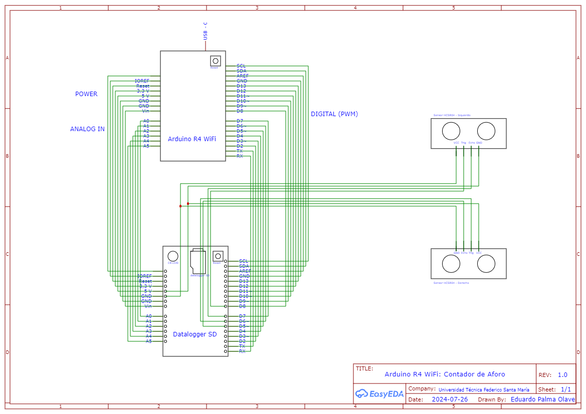
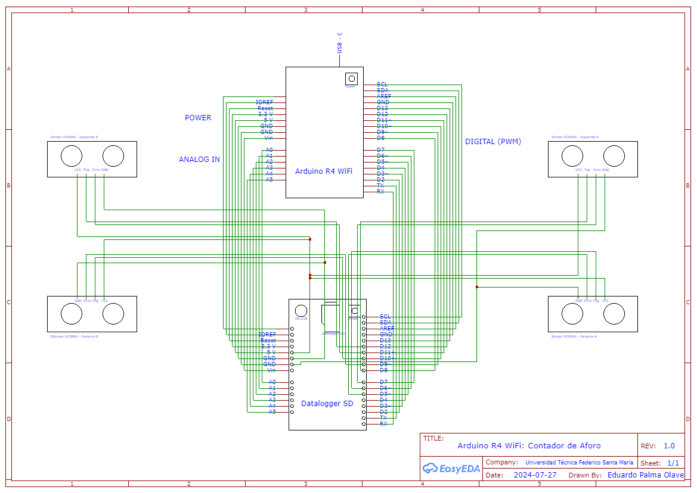

# Proyecto Control de Aforo - Universidad Técnica Federico Santa María

**Ingeniería Civil Telemática**

---

### Estudiante:
- **Nombre:** Eduardo Palma Olave
- **Correo electrónico:** eduardo.palmao@usm.cl
- **GitHub:** [@adreoud](https://github.com/adreoud)

---

## Descripción del Proyecto

Este proyecto tiene como objetivo registrar el ingreso y egreso en las salas de clase de los edificios del campus de la Universidad Técnica Federico Santa María utilizando una placa Arduino R4 WiFi. Se empleará un datalogger SD para almacenar los datos de los registros obtenidos mediante dos sensores ultrasónicos HC-SR04, diferenciados como "izquierdo" y "derecho", para cada entrada identificada como "Entrada A" y "Entrada B". 

### Funcionamiento del Sistema

Para diferenciar el ingreso del egreso, se define el estado de actividad para cada sensor. Cuando ocurre una perturbación dentro de un margen de error de cinco centímetros, se determina si fue un ingreso o egreso dependiendo de la dirección del cambio:

- **Ingreso:** De derecha a izquierda.
- **Egreso:** De izquierda a derecha.

Los registros se guardan en un archivo de texto en la memoria micro SD con el siguiente formato:

```
"Campus;Edificio;Numero;Entrada;Contador-Ingresos;Contador-Egresos;Ingreso-Egreso;Fecha;Hora"
```

Estos archivos se subirán a una base de datos configurada en una Raspberry Pi para almacenamiento y análisis.

### Componentes del Sistema

1. **Arduino R4 WiFi:** Placa principal que controla los sensores y registra los datos.
2. **Sensores Ultrasónicos HC-SR04:** Detectan la entrada y salida a través de perturbaciones en el estado de los sensores.
3. **Datalogger SD:** Almacena los registros de datos.
4. **Base de Datos Raspberry Pi:** Almacena y gestiona los registros de ingresos y egresos.
5. **Interfaz Gráfica en Python:** Permite la visualización y análisis de los datos almacenados.

### Diseño Electrónico

El sistema estará centrado en la parte superior del marco de las puertas con dos módulos, izquierdo y derecho. El lado derecho siempre se ubicará en la parte exterior y el izquierdo en la parte interior, ambos centrados en la mitad de la puerta. Junto a ellos, habrá una caja que contendrá la instalación del Arduino con sus respectivas conexiones eléctricas.

- **Modelo de Una Puerta:**
  
  
- **Modelo de Dos Puertas:**
  
  
### Diseño de Modulos de Puerta


### Alimentación del Arduino

Para asegurar un funcionamiento continuo y estable del sistema de control de aforo basado en el Arduino R4 WiFi, es crucial gestionar adecuadamente su alimentación eléctrica. Existen varias formas de proporcionar energía al Arduino:

#### Método 1: Alimentación Directa con Regulación

En este método, se utiliza una fuente de alimentación directa regulada para proporcionar una tensión constante y adecuada al Arduino. Este enfoque es ideal para proyectos permanentes donde se requiere una instalación fija y segura.

**Componentes Necesarios:**
- Fuente de alimentación DC regulada (7V a 12V).
- Regulador de voltaje (si la fuente de alimentación no está regulada).
- Conectores de alimentación compatibles.

**Conexión:**
1. **Fuente de Alimentación**: Conecta una fuente de alimentación DC regulada con un voltaje entre 7V y 12V al pin de entrada de voltaje (Vin) del Arduino R4 WiFi.
2. **Regulador de Voltaje** (si es necesario): Si la fuente de alimentación no está regulada, utiliza un regulador de voltaje para asegurar que el Arduino reciba una tensión estable.
3. **GND**: Conecta el terminal negativo (GND) de la fuente de alimentación al pin GND del Arduino.

#### Método 2: Adaptador de Corriente

Usar un adaptador de corriente (wall adapter) es una opción conveniente y segura, especialmente para prototipos y proyectos que requieren movilidad o cambios frecuentes en la configuración.

**Componentes Necesarios:**
- Adaptador de corriente compatible (9V a 12V, con conector de 2.1mm centro positivo).

**Conexión:**
1. **Adaptador de Corriente**: Inserta el conector del adaptador de corriente en el puerto de alimentación del Arduino (jack DC).
2. **Verificación de Polaridad**: Asegúrate de que el adaptador de corriente tiene la polaridad correcta (centro positivo).

### Consideraciones Adicionales:

- **Protección contra Sobrecorriente**: Utiliza un fusible o un limitador de corriente para proteger el Arduino y otros componentes del circuito contra sobrecorrientes.
- **Estabilidad de la Fuente de Alimentación**: Asegúrate de que la fuente de alimentación o el adaptador proporcionen un voltaje estable y suficiente corriente para todos los componentes conectados al Arduino.
- **Longitud del Cable**: Minimiza la longitud del cable entre la fuente de alimentación y el Arduino para reducir la caída de voltaje y posibles interferencias.

### Restricciones y Delimitaciones

- **Capacidad de Memoria:** La capacidad de la memoria SD utilizada puede limitar la cantidad de datos que se pueden almacenar localmente.
- **Conexión a Internet:** Es esencial para subir los datos a la base de datos Raspberry Pi, lo que implica una dependencia de la estabilidad de la red WiFi.
- **Precisión de los Sensores:** Los sensores ultrasónicos tienen una precisión limitada y un margen de error de cinco centímetros.
- **Alimentación Eléctrica:** La estabilidad de la fuente de alimentación es crucial para el correcto funcionamiento del sistema.

### Posibles Errores y Soluciones

- **Error de Conexión de la Tarjeta SD:** 
  - **Solución:** Verificar la conexión física de la tarjeta y reiniciar el sistema.
  
- **Error en el Módulo RTC:**
  - **Solución:** Asegurarse de que la batería del RTC esté correctamente instalada y reemplazarla si es necesario.
  
- **Error de Conexión WiFi:**
  - **Solución:** Verificar las credenciales de la red y la intensidad de la señal. Reiniciar el módulo WiFi si el problema persiste.
  
- **Error de Sensores Ultrasónicos:**
  - **Solución:** Comprobar las conexiones de los sensores y su alineación correcta. Recalibrar si es necesario.

### Información del creador del programa

- **Nombre:** Eduardo Palma Olave
- **Estudiante de Ingeniería Civil Telemática**
- **Universidad Técnica Federico Santa María, Campus San Joaquín**
- **Correo electrónico:** eduardo.palmao@usm.cl
- **GitHub:** [@adreoud](https://github.com/adreoud)

---

## Código del Proyecto

El código del proyecto se encuentra en el archivo `capacityCounter-v1.0.ino` y está estructurado de la siguiente manera:

### Bibliotecas Utilizadas

```cpp
#include <Wire.h>
#include <RTClib.h>
#include <WiFi.h>
#include <WiFiClient.h>
#include <ArduinoJson.h>
#include <SD.h>
#include <SPI.h>
#include <NewPing.h>
```

### Identificación del Arduino

```cpp
const char* campus = "SanJoaquin";
const char* edificio = "A";
const char* numeroSala = "001";
const char* entradaA = "EntradaA";
const char* entradaB = "EntradaB";
```

### Definición de los Pines para los Sensores

```cpp
#define TRIG_PIN_DERECHO 6
#define ECHO_PIN_DERECHO 5
#define TRIG_PIN_IZQUIERDO 8
#define ECHO_PIN_IZQUIERDO 7
#define TRIG_PIN_DERECHO_B 10
#define ECHO_PIN_DERECHO_B 9
#define TRIG_PIN_IZQUIERDO_B 12
#define ECHO_PIN_IZQUIERDO_B 11
```

### Definición de la Distancia Umbral y Tolerancia

```cpp
#define DISTANCIA_UMBRAL_DERECHO 50  // Distancia umbral en cm para el sensor derecho
#define DISTANCIA_UMBRAL_IZQUIERDO 50 // Distancia umbral en cm para el sensor izquierdo
#define TOLERANCIA 5  // Tolerancia en cm
```

### Configuración de la Conexión WiFi

```cpp
const char* ssid = "your_SSID";
const char* password = "your_PASSWORD";

void setup() {
  // Configuraciones iniciales
}

void loop() {
  // Código principal del contador de aforo
}
```

### Registro de Datos

```cpp
void registrarIngreso() {
  // Código para registrar un ingreso
}

void registrarEgreso() {
  // Código para registrar un egreso
}
```

### Manejo de Errores

```cpp
void verificarErrores() {
  // Código para verificar errores y desconexiones
}
```

---

## Requisitos

- Arduino R4 WiFi
- Sensores ultrasónicos HC-SR04
- Datalogger SD
- Raspberry Pi para la base de datos
- Conexión a internet para subir datos a la base de datos

---

## Instalación

1. Clona el repositorio desde GitHub.
2. Abre el archivo `capacityCounter-v1.0.ino` con el IDE de Arduino.
3. Configura tu SSID y contraseña de WiFi en el código.
4. Sube el código a la placa Arduino.
5. Conecta los sensores y el datalogger siguiendo el diagrama de conexiones.

---

## Uso

Una vez instalado y configurado, el sistema comenzará a registrar los ingresos y egresos automáticamente. Los datos se almacenarán en la tarjeta SD y se subirán a la base de datos configurada.

---

## Contribuciones

Para contribuir al proyecto, por favor sigue las siguientes pautas:

1. Haz un fork del repositorio.
2. Crea una rama con tus cambios: `git checkout -b feature/nueva-funcionalidad`.
3. Realiza un pull request detallando las mejoras.

---

## Licencia

Este proyecto está licenciado bajo la Licencia MIT. Para más información, consulta el archivo LICENSE en el repositorio.

---
